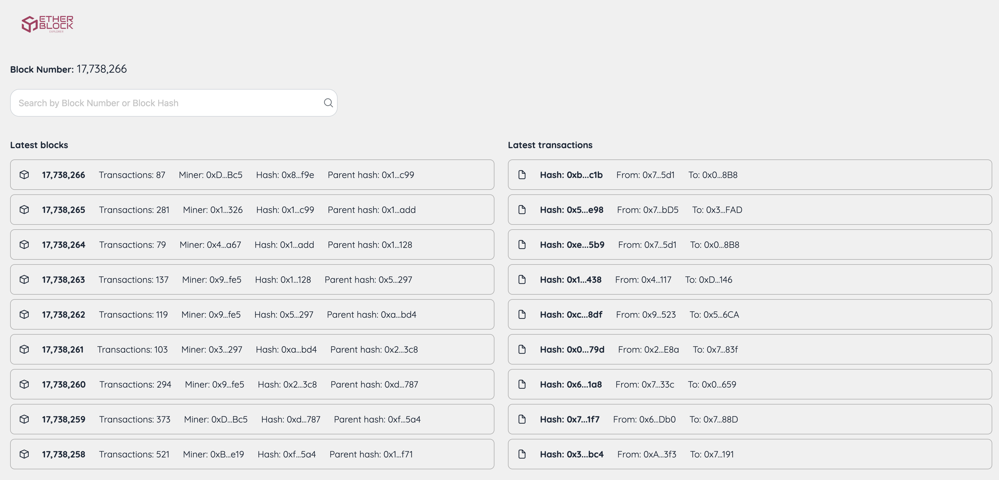

# Etherscan Clone Project



This project is an Etherscan clone, a popular tool used to explore and analyze the Ethereum network. It utilizes the Alchemy SDK and ethers.js to interact with the network and provides information about the latest 10 blocks and the latest 10 transactions.

## Technology Used

- Next.js: Next.js is a React framework for web applications. We chose it for its focus on ease of development and its ability to support server-side rendering and static site generation.

- Alchemy SDK: The Alchemy SDK allows us to access reliable and optimized blockchain data through its API. We use Alchemy to retrieve up-to-date information about Ethereum blocks and transactions.

- ethers.js: The ethers.js library is widely used for interacting with smart contracts and conducting transactions on Ethereum. It enables us to work with addresses, hashes, and perform cryptographic calculations efficiently.

## Key Features

- Latest 10 Blocks Listing: We display a list of the latest 10 mined blocks on the Ethereum network, providing key details such as block number, hash, and the number of transactions included in each block.

- Latest 10 Transactions Listing: We present a list of the latest 10 confirmed transactions on the network. We include essential information such as transaction hash, sender, recipient, and the value transferred.

- Block Number or Hash Search: Users can perform specific searches using the desired block number or block hash. This makes it easier to access specific information for research and analysis purposes.

## Screenshot


## Installation and Usage

1. Clone this repository to your local machine.

2. Install the dependencies using npm or yarn:

```bash
npm install
# or
yarn install
```

3. Start the application in development mode

```bash
npm run dev
# or
yarn dev
# or
pnpm dev
```

4. Open your browser and go to `http://localhost:3000` to access the project.

## Contribution

We welcome all contributions to this project! If you would like to collaborate, please send a pull request, and we will be happy to review it.

---

We hope this project proves to be useful and provides you with a powerful tool to explore and analyze the Ethereum network. If you have any questions or concerns, feel free to contact us or open an issue in this repository. Enjoy exploring the blockchain with our Etherscan clone!
